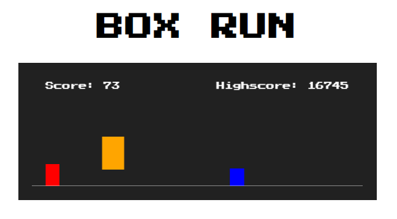
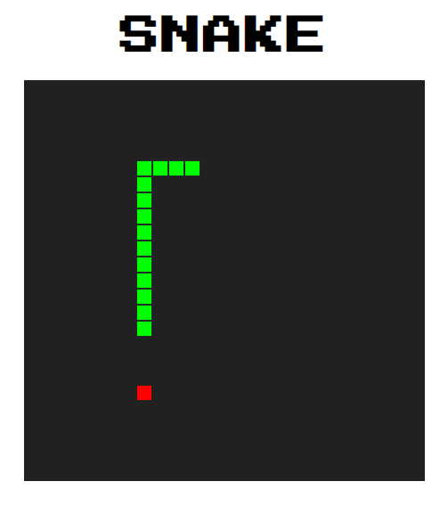

# ReCreate Games

This repository is for simple 2D games.

## How to contribute

- Fork this repository
- Clone the repository to your computer
- Commit your games to your repository
- Create an issue and pull request
- Add screenshot of your game to `images` directory and update game info in `README.md`

## Category

- [Box Run](https://github.com/edogawadore/games#box-run)
- [Snake](https://github.com/edogawadore/games#snake)

## Games

### Box Run

> A Simple Google Chrome T-Rex Game

In this game, player has to avoid obstacles by jumping (using &#8593; or `space`
key) or dodging (using &#8595; or `shift` key).

    

### Snake

> A Normal Game of Snake

In this game, player controls a snake to find and eat apples using arrow keys
&#8592;, &#8593;, &#8594;, &#8595; to move left, up, right, down. The more
apples the snake eats, the longer the snake becomes. The game ends when the snake
hits the border or eat its tail.

    

