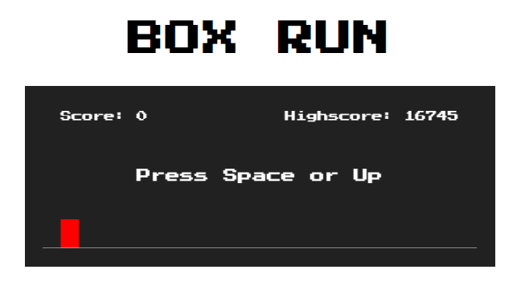
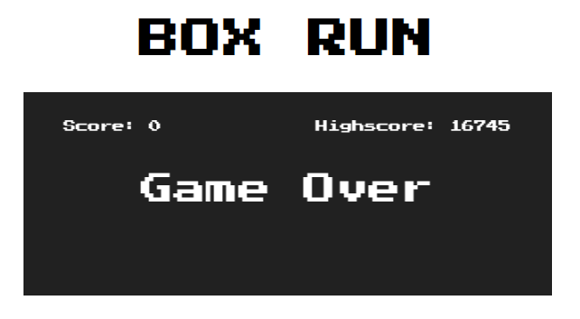

# ReCreate Games

This repository is for simple 2D games.

## How to contribute

- Fork this repository
- Create an issue and link it to the PR
- Add screenshot of your game to `images` directory and update game info in `README.md`

## Game contributed

### Box Run

> A Simple Google Chrome T-Rex Game

In this game, player has to avoid obstacles by jumping (using &#8593; or `space`
key) or dodging (using &#8595; or `shift` key).

    
    <h4>Start Screen</h4>

    
    Gameplay

    
    Game Over

